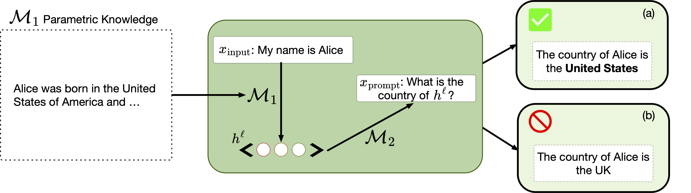

# Do Activation Verbalization Methods Convey Privileged Information?
This is the codebase for [Do Activation Verbalization Methods Convey Privileged Information?](https://arxiv.org/abs/2509.13316).



## Getting Started
This codebase is a minimal reproduction of parts of the paper, which we divide into two sections. [Part 1](#part-1-baselines-and-activation-inversion) includes experiments related Section 3 (zero-shot prompting) and Section 4 (activation inversion). [Part 2](#part-2-personaqa) includes experiments related to Section 5, which is PersonaQA.

LIT-based methods require a model trained with Latent Interpretation Tuning; refer to the [LatentQA](https://github.com/aypan17/latentqa) codebase for training details. Patchscopes uses off-the-shelf models and require no additional training.

Note that the Patchscopes run in this repository runs Patchscopes linearly as opposed to in parallel -- as mentioned in the appendix of the paper, this can change the results. In the main body of the paper, we run Patchscopes in parallel.

### Setup
To set up the environment for this:

```bash
conda env create -f environment.yml
conda activate verb_faithfulness
pip install flash-attn==2.7.4.post1 --no-build-isolation
```

## Datasets
### Feature Extraction
The feature extraction dataset can be found in the Patchscopes [repository](https://github.com/cywinski/patchscopes/tree/main/patchscopes/code), specifically in the `preprocessed_data` directory, and we use the exact samples that are filtered from their code. For ease of access, we provide the dataset directly in the ``/datasets/feature_extraction``.

### PersonaQA
The training dataset for PersonaQA can be downloaded from [here](https://drive.google.com/drive/folders/1v-4LJ54aolIp5zN74eDWqCc-_Zq3Btu6?usp=drive_link). We include all three datasets: PersonaQA, PersonaQA-Shuffled, and PersonaQA-Fantasy.

In the ``PersonaQA`` folder, the original prompts used to generate the dataset are shown. In ``PersonaQA-Shuffled`` and ``PersonaQA-Fantasy``, we include the text used to train the models and the associated attributes in the respective ``profiles.json`` folder.

For the Section 5.3 of the paper (extended ``PersonaQA-Fantasy``), refer to the Appendix F.2 for the additional prompts.

We use the ``PersonaQA`` dataset for training the model to be inspected by the verbalizer; specifically, we use both ``bios.jsonl`` and ``interviews.jsonl`` for training; for evaluation (and the prompts used for evaluation), refer to Appendix F.2 for more information. For ease of directly evaluating the models, we also include the trained models directly on Huggingface at `millicentli/Llama-3-8B-PersonaQA`, `millicentli/Llama-3-8B-PersonaQA-Shuffled`, and `millicentli/Llama-3-8B-PersonaQA-Fantasy`, which can be used out of the box.

We also include the prompts used to evaluate the PersonaQA datasets in ``/datasets/personaqa``. This is different from the training dataset, is downloaded from the link noted above.

## Part 1: Baselines and Activation Inversion
### Experiment 1: Zero-shot and Verbalization

Run `scripts/exp1.sh` to reproduce the zero-shot baseline, Patchscopes, and LIT results on the feature extraction tasks. Set the following variables at the top of the script:
- `LIT_CKPT` — path to a trained LIT checkpoint (or pull it from the original LIT paper)
- `TARGET_MODEL` / `DECODER_MODEL` — model names for Patchscopes (default: Llama-3.1-8B-Instruct)

#### Evaluation
To view the zero-shot prompting results, use the following notebook: `view_prompt_baseline.ipynb`

### Experiment 2: Inversion
We try to invert the activations that are passed into the verbalizer to inspect the input information they might contain. Our inversion code is based on [LatentQA](https://github.com/aypan17/latentqa) and [Vec2Text](https://github.com/jxmorris12/vec2text) codebases.

The `inversion/` directory contains a vendored copy of vec2text, originally authored by Morris et al. 2023, 2024. See `inversion/NOTICE` for attribution details and a summary of local modifications.

#### Setup
```bash
cd inversion
pip install -e inversion/
```

#### Training
Two inversion models are used in Experiment 2, each with its own training script. Run these commands to train your own, or use the models uploaded on Huggingface (`millicentli/llama3_inversion_llama3_multi` for multiple activations and `millicentli/llama3_inversion_t5-base_single` for a single activation).

**LIT inverter** (Llama3 → Llama3, multi-token activations): trains text reconstruction using `Llama-3.1-8B-Instruct`.
```bash
sbatch scripts/train_full_acts_inverter.sh
```

**T5 inverter** (Llama3 → T5, single-token activation): trains text reconstruction using a T5-base vec2text model for `Llama-3.1-8B-Instruct`.
```bash
sbatch scripts/train_single_act_inverter.sh
```

Note that training both models manually can be very slow, and there was no optimization done to necessarily improve the speed. For instance, when training the LIT inverter, we opted to end training early because it had already converged early on -- use your own discretion here, as the main goal is to show that inversion of activations is inherently possible.

Run `scripts/exp2.sh` to run both inversion methods (LIT/Llama3 and Patchscopes/T5) followed by zero-shot prediction on the inversion outputs. Set the following variables at the top of the script:
- `LIT_INV_CKPT` — path to a trained LIT inversion checkpoint (PEFT adapter)
- `T5_INV_CKPT` — path to a trained T5 vec2text checkpoint

#### Evaluation
To view the inversion results, use the following notebook: `view_inversion_results.ipynb`

## Part 2: PersonaQA
Using the same models from [Part 1](#part-1-baselines-and-activation-inversion), we run the verbalization methods on PersonaQA and the derivative datasets. We provide a pipeline to initially run PersonaQA using the verbalization methods, though we leave additional analyses from the paper out for simplicity.

First, download the training PersonaQA datasets. Then, put it in the same directory as the feature_extraction dataset. Then, train a target LM on the PersonaQA datasets. We provide the models that we trained on Huggingface, which can be accessed at `millicentli/Llama-3-8B-PersonaQA`, `millicentli/Llama-3-8B-PersonaQA-Shuffled`, and `millicentli/Llama-3-8B-PersonaQA-Fantasy`. Note that the training is simple and can easily be done: we just include both the `bios.jsonl` and `interviews.jsonl` and their text field as input for training via next token prediction.

### Experiment 3: PersonaQA Verbalization

Run `scripts/exp3.sh` to reproduce the zero-shot baseline, Patchscopes, and LIT results across all three PersonaQA model variants (PersonaQA, PersonaQA-Fantasy, PersonaQA-Shuffled). Set the following variables at the top of the script:
- `BASE_DIR` — path to this repository
- `OUTPUT_DIR` — path to scratch/output directory
- `LIT_CKPT` — path to a trained LIT checkpoint (same checkpoint used in Experiment 1)
- `MODEL_DIR` — directory containing the three fine-tuned PersonaQA models

The eval prompts for all three variants are included in `datasets/personaqa/`. The zero-shot baseline uses `meta-llama/Llama-3.1-8B-Instruct`; Patchscopes and LIT read activations from the respective fine-tuned target model.

#### Evaluation
To view the PersonaQA results, use the following notebook: `view_personaqa_results.ipynb`

## Citation
If you found our work helpful and/or used our PersonaQA dataset, please cite the following:

```
@inproceedings{li2026activationverbalizationmethodsconvey,
      title={Do Activation Verbalization Methods Convey Privileged Information?}, 
      author={Millicent Li and Alberto Mario Ceballos Arroyo and Giordano Rogers and Naomi Saphra and Byron C. Wallace},
      booktitle={Forty-third International Conference on Machine Learning},
      year={2026},
      url={https://openreview.net/forum?id=IFGTKwHwK6},
}
```